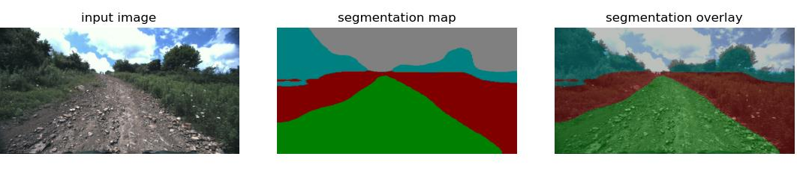
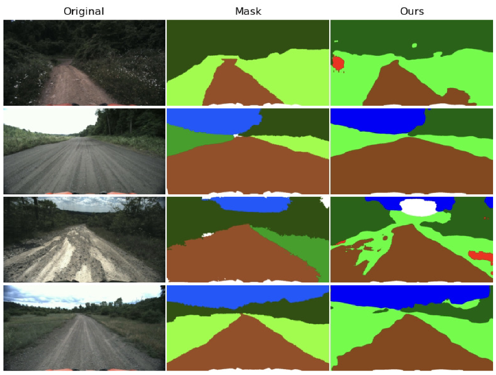

# Semantic segmentation of off-road images using transfer learning and DeepLabv3+
A transfer learning follow-up using DeepLabV3+ and the Yamaha-CMU Off-Road Dataset

### Author: Nate Haddad - *nhaddad2112[at]gmail[dot]com*

## Abstract:
Many state-of-the-art deep learning algorithms require both a large training dataset and compute power, which for a variety of reasons is not always available to the user. Training large networks from scratch becomes tedious, and time consumer for the end-user. Transfer learning is a machine learning method where the transfer of knowledge from one domain to another, which ultimately eliminates the need to train from scratch using randomly initialized networks and benchmark datasets. Transfer is a popular technique in the computer vision field, given the vast compute and time resources required to train neural network architectures. In this paper, we will examine the effect of transfer learning on large encoder-decoder style deep neural networks applied to the task of semantic segmentation. DeepLabv3+ is one such architecture that was state-of-the-art at the time of its publishing in 2018. By applying depth-wise separable convolution to altrous spatial pyramid pooling and decoder modules, DeepLabv3+ was able to successfully incorporate techniques from the 2016 Xception model, resulting in faster, more powerful, and larger networks. We propose extending the use of a pre-trained DeepLabv3+ model to the challenging task of off-road perception. Utilizing the newly available Yamaha-CMU Off-Road Dataset, we successfully employ transfer learning techniques to a pre-trained model for the task of semantic segmentation of off-road images.  

Please email me for the full report

## Installation:

### Setting up the Repository: 

The following instructions will set up the repository for training and inference. It creates a `data` directory, which is used to store training data. Steps 3 and 4 will download and unzip the *[Yamaha-CMU Off-Road Dataset](https://theairlab.org/yamaha-offroad-dataset/)* to the `data` directory.

1. `git clone https://github.com/nmhaddad/semantic-segmentation.git && cd semantic-segmentation`
2. `mkdir data && cd data`
3. `wget https://public.boxcloud.com/d/1/b1!5_MHlrEWg6Z_gOxh0mB5s7Bi3-Bv9hPfTn-vwED9A0EzxO6QINDkqFiOimj4xAe0-N4velYsHF4lINbhbhhiktLAmTDEljb3aix0LtEf0-DaP1Ni_kaInfj2-wPQvSSDqfCa7FTcvqq5cEkb5f1UKoXqmgM9i4NtxP_j3eaYaTz4ENWFtXcFOQzxDPuV6xGi2Rp9jeCA4mAaMPfnoU3C62MhDo9ICt8ik0OJRQRBjsjYE0eQDlBJKj8TaGoILblrWPtKrOm5RewiAMH1is9iSqJwl0c-xSSeY_3Hr9HB0jA1rQVlie5rHn2Xq3J4gvRzUZcQ5FxXQSvKDzAuSdKyO4M3CRZM_VZVy4lzD6zL21SlYQVlRCygAUNi5nyR-kh4t6HrO064PbhNJvl6a18ZTWf3vzLcAxEeN2BMvHEiXPDlksniXOkPjN3W-QEKV9wRLU5C8xAl594BXKlgk63vd9oxoNadM6T2NZNq6xJ4IQwukqlRx5IuAnk7NiBhMmxGN932XDOtgDvyY5mSw5bvfFnG7jMVmR6lOXXT3bgbkvMDMtIXfUqvn2jWffoIUfyAi0hv8BdN0woRtrLJLGB6DEl-XN1jPaUPv_X1Ax5ipj853AI4CkYDA9K_iquTO-EwCD2D9nnOMIgXTqnicSYSNDximWJAEQe53pWjEan7yq3a44i2RkyUJuZD7UCNPdwmoBM1aRRaR_fmct4u2tKnAbGKvQRc5YAO5xSvI9jZRcTrCPw9qZtHRrjp3CiYaLFNI7IUY0UIjvPzvHqyzjbaIsaKmm4oYpcTP_x75JE5YAzjvK3VL5Q_6HqdQQpHvfOOOBxv_M68Fi-c0AwySWgXvcW8kWYYljmdOmRnSSn0KFtxFByZ-cc2Ej1Gse8xe-wuaAel-IsdBfQfXfqSeyNh3DxIX3uw0HYRu3e7gr_vw3rJnd2YW4t-g2bp2I1XKM0x-2jWo1jVvV5tSYHJA8JkQacHBbchi1_hRJzEuTD_vCZJKCyGajhY9hVl2S9x0T4Ji13ShHHSODLgj5CkPcED7g5ZD5BdOUoSKtncnaMGvJLJ6vXsDwk2v41E6g5DTQqLI9AruGKAt49P8XOKWcF_jGB2ZcqZAMCXUfSNGxUxs1tx-Alz8UJZlvw21ylJ_cn3ln8sccf7_Oe7cbQPSYUtsxh1NXu1d1Q-8cgyt8jkDhaJa7Bszm1iqmdiCoRCQAORLnAzksr1aRPQaX_wX3lyvb8DH5J1yJbg4DUfOpucjVElNGbG7sR5cKB5z1VbYr-OlQ../download`
4. `unzip yamaha_seg.tar.gz`

### Installing Dependencies with Anaconda
The simpliest way to get this repo up and running is to use our anaconda `environment.yaml` file:

`conda env create -f environment.yaml`

To activate, run `conda activate semantic-segmentation`.

## Models

[Pretrained Models](https://drive.google.com/drive/folders/1Gmk8vOF9qBNMg3-TEL-st6KWieB4Af5e?usp=sharing)

## Running:

You can configure your training environment with the `config/config.yaml` file. This YAML file includes a variety of hyperparameters and paths for training and testing models. It's meant to simplify experimentation.

There are two notebooks, `training_demo.ipynb` and `inference_demo.ipynb` that make it simple to run the code here in the repository. Just make sure you have downloaded the *[Yamaha-CMU Off-Road Dataset](https://theairlab.org/yamaha-offroad-dataset/)* before training.

Run `python train.py` to run a standalone training session.

Run `python test.py` to run a standalone inference session on single images.

Run `python process_video.py` to run a standalone inference session on videos.

## References:

[1] Chen, Liang-Chieh, Zhu, Yukun, Papandreou, George, Schroff, Florian, and Adam, Hartwig. "Encoder-Decoder with Atrous Separable Convolution for Semantic Image Segmentation.” Computer Vision – ECCV2018 (2018): 833-51. Web.  

[2] Chollet, Francois. "Xception: Deep Learning with Depthwise Separable Convolutions.” 2017 IEEE Conference on Computer Vision and Pattern Recognition (CVPR) (2017): 1800-807. Web.  

[3]  Daniel Maturana and Po-Wei Chou and Masashi Uenoyama and Sebastian Scherer, “Real-time Semantic Mapping for Autonomous Off-Road Navigation” in Maturana-2017-102768, September 2017, pp. 335 - 350.  

[4]  Stevo. Bozinovski  and  Ante  Fulgosi  (1976).  "The  influence of pattern similarity and transfer learning upon the training of a base perceptronB2.” (original in  Croatian) Proceedings of Symposium Informatica 3-121-5, Bled.  

[5] Stevo Bozinovski (2020) "Reminder of the first paper on transfer learning in neural networks, 1976”. Informatica 44: 291–302.  

[6] Pan, S.J.; Yang, Q. A survey on transfer learning. IEEE Trans. Knowl. Data Eng. 2010, 22, 1345–1359  

[7] M. S. Minhas, “Transfer Learning for Semantic Segmentation using PyTorch DeepLabv3,” GitHub.com/msminhas93, 12-Sep-2019. [Online]. Available: https://github.com/msminhas93/DeepLabv3FineTuning.
